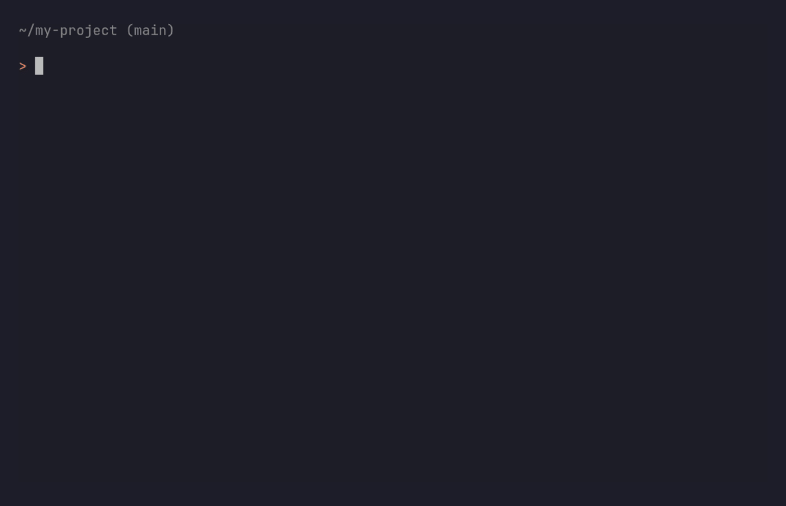

# Jolli Memory

[](LICENSE)
[](https://scorecard.dev/viewer/?uri=github.com/jolliai/jolliai)
[](https://www.npmjs.com/package/@jolli.ai/cli)
[](https://marketplace.visualstudio.com/items?itemName=jolli.jollimemory-vscode)

> *Every commit deserves a Memory. Every memory deserves a Recall.*

**Jolli Memory** automatically turns your AI coding sessions into structured development documentation attached to every commit, with no extra effort.

When you work with AI agents (Claude Code, Codex, Gemini, OpenCode, Cursor, GitHub Copilot CLI, or VS Code Copilot Chat), the reasoning behind every decision lives in the conversation: *why this approach was chosen, what alternatives were weighed, what went wrong along the way*. The moment you commit, that context is gone. Jolli Memory captures it automatically.



*Ask your AI agent about a past decision; it answers from the reasoning Jolli captured at commit time.*

---

## Quick start

Install the CLI, run `jolli`, and your next commit becomes your first memory.

```bash
npm install -g @jolli.ai/cli   # requires Node 22.5+
cd your-repo
jolli                          # guided setup: sign in to Jolli, enable hooks, optional backfill
```

Sign in when prompted (it opens your browser, no API key to manage). That is the whole setup: work with your AI agent as usual, commit, and the memory is written automatically. Read it back anytime:

```bash
jolli view      # recent commit summaries
jolli recall    # full branch context, ready to feed back to your agent
```

Full walkthrough: [Getting started with Jolli Memory](https://docs.jolli.ai/jolli-memory/getting-started-with-jolli-memory).

Prefer an in-editor panel? The same memories show up in the [VS Code extension](vscode/) and the [JetBrains plugin](intellij/) (preview). See [Which install is right for me?](#which-install-is-right-for-me) below.

> **Before you start**
> - **Node 22.5+** and a **git repository** (hooks live in `.git/hooks`).
> - **A free Jolli sign-in** to generate summaries. Bring-your-own Anthropic API key also works if you'd rather (`jolli configure --set apiKey=...`), but signing in is the quickest path and needs no key management. With no credential at all, hooks still record sessions but no summary is written; local `search` / `recall` / `view` work with no account.
> - **Restart your AI agent session** after enabling, so the hooks take effect.
> - Installing the CLI globally does nothing on its own: run `jolli` inside a repo to enable it there.
> - **Windows:** if `npm` is "not recognized", install Node from [nodejs.org](https://nodejs.org) and reopen your terminal.

---

## What you get

- **Never lose the _why_.** Every commit gets a structured memory: the trigger behind the change, the decisions and trade-offs, and what was actually built.
- **Works with 7 AI agents.** Claude Code, Codex, Gemini, OpenCode, Cursor (Composer), GitHub Copilot CLI, and VS Code Copilot Chat. Sessions are detected automatically, no per-tool setup.
- **Ask your agent about past work.** `jolli mcp` exposes your history over the Model Context Protocol (9 tools: search, recall a branch, trace a decision's timeline, list branches, draft a PR description, and more), so your agent can answer "how did we handle X?" and draft PRs without leaving the chat. Registered automatically when you enable.
- **Catch up on history.** `jolli backfill` writes memories for commits you made before installing Jolli.
- **Knowledge wiki and graph.** `jolli compile` folds work scattered across many commits into per-topic pages; `jolli graph` renders them as an interactive, shareable map of decisions and how they connect. Both build in the background.
- **Local-first and private.** Every memory is written to your own repo and to a plain-Markdown folder on disk you can read or `grep`. Transcripts stay on your machine unless you choose to share. The Jolli LLM proxy does not persist or log transcripts or diffs.

Free and open source (Apache-2.0). A hosted **Jolli Space** for team sharing is optional.

---

## Which install is right for me?

| You use... | Install |
| -- | -- |
| **The terminal, Vim / Emacs, or CI** | the [CLI](cli/) (recommended) |
| **VS Code** | the [VS Code extension](vscode/) (bundles the CLI) |
| **A JetBrains IDE** | the [IntelliJ plugin](intellij/) (preview) |
| **Several editors** | the CLI globally, plus each editor plugin. They share the same data. |

---

## How it works

After each commit, a background process reads your AI session transcript and the code diff, calls the LLM, and writes a structured summary. Your commit returns instantly; the summary lands about 10 to 20 seconds later. Memories are stored on a dedicated git orphan branch (`jollimemory/summaries/v3`), completely separate from your code history, and mirrored to a readable Memory Bank folder on disk.

More detail: [How capture works](https://docs.jolli.ai/jolli-memory/supported-ai-assistants-and-capture) · [Recall vs. search](https://docs.jolli.ai/jolli-memory/recall-vs-search) · [Use your memory from any AI assistant (MCP)](https://docs.jolli.ai/jolli-memory/use-your-memory-from-any-ai-assistant-mcp).

---

## Documentation

- **Guides:** [docs.jolli.ai](https://docs.jolli.ai/jolli-memory/getting-started-with-jolli-memory), covering getting started, supported assistants, MCP, Memory Bank and sync, CI, and a full reference.
- **Troubleshooting and FAQ:** [docs.jolli.ai/jolli-memory/troubleshooting-and-faq](https://docs.jolli.ai/jolli-memory/troubleshooting-and-faq).
- **Per-surface reference:**

| Surface | README | CHANGELOG |
| -- | -- | -- |
| CLI | [`cli/README.md`](cli/README.md) | [`cli/CHANGELOG.md`](cli/CHANGELOG.md) |
| VS Code extension | [`vscode/README.md`](vscode/README.md) | [`vscode/CHANGELOG.md`](vscode/CHANGELOG.md) |
| IntelliJ plugin | [`intellij/README.md`](intellij/README.md) | [`intellij/CHANGELOG.md`](intellij/CHANGELOG.md) |

---

## Also available: Jolli Site

Turn a folder of Markdown and OpenAPI specs into a polished documentation site. Site generation ships as a separate plugin, `@jolli.ai/site-cli` (`npm install -g @jolli.ai/site-cli`); the CLI discovers it automatically and lists its commands (`new` / `dev` / `build` / `start` / `convert`) in `jolli --help`. See the [Jolli Site section of the CLI README](cli/README.md#2-jolli-site--documentation-site-generation) for details.

---

## Repository layout

Monorepo with three deliverables that share one product model and storage:

```
jolliai/
├── cli/          Node.js CLI (@jolli.ai/cli, npm workspace)
├── vscode/       VS Code extension (npm workspace)
├── intellij/     IntelliJ plugin (Kotlin + Gradle)
├── package.json  Root workspace config (coordinates cli + vscode)
└── .nvmrc        Pinned Node version for development
```

`cli/` and `vscode/` are npm workspaces coordinated from the root `package.json`. `intellij/` is a separate Gradle project.

### Development quick start

Requires the Node version in `.nvmrc` (currently 24.10.0, which is the development toolchain, distinct from the 22.5+ runtime floor for users):

```bash
npm install
npm run build        # builds both CLI and VS Code
npm run all          # clean, build, lint, test (run this before committing)
```

Per-workspace variants exist (`npm run build:cli`, `npm run test:vscode`, and so on). IntelliJ: see [`intellij/DEVELOPMENT.md`](intellij/DEVELOPMENT.md).

---

## Contributing

Contributions welcome. Please read [`CONTRIBUTING.md`](CONTRIBUTING.md) (workflow, code style, DCO sign-off) and [`CODE_OF_CONDUCT.md`](CODE_OF_CONDUCT.md).

## Support

- **Issues and feature requests:** [GitHub Issues](https://github.com/jolliai/jolliai/issues)
- **Questions and how-to:** see [`SUPPORT.md`](SUPPORT.md)
- **Jolli Space onboarding / enterprise:** support@jolli.ai

## License

[Apache License 2.0](LICENSE)
