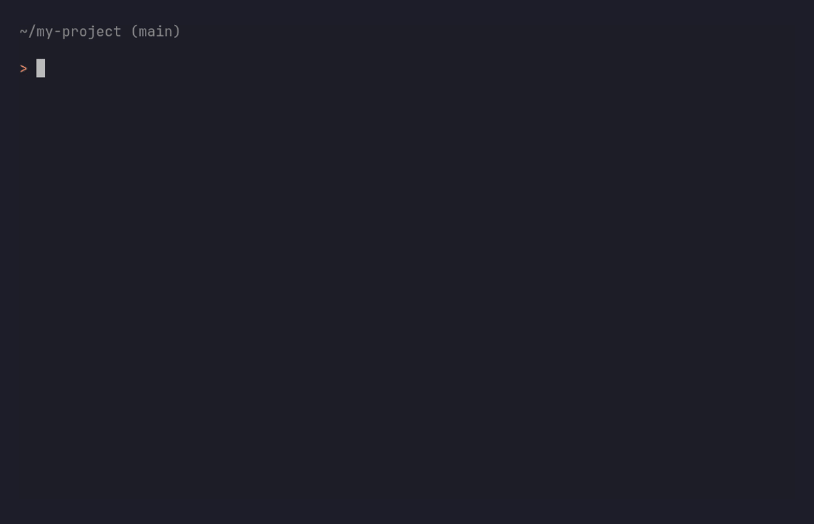

# Jolli Memory

[](LICENSE)
[](https://scorecard.dev/viewer/?uri=github.com/jolliai/jolliai)

[](https://www.npmjs.com/package/@jolli.ai/cli)
[](https://www.npmjs.com/package/@jolli.ai/cli)
[](https://marketplace.visualstudio.com/items?itemName=jolli.jollimemory-vscode)
[](https://open-vsx.org/extension/jolli/jollimemory-vscode)
[](https://open-vsx.org/extension/jolli/jollimemory-vscode)
[](https://plugins.jetbrains.com/plugin/31187)

> *Every commit deserves a Memory. Every memory deserves a Recall.*

**Jolli Memory** automatically turns your AI coding sessions into structured development documentation attached to every commit, with no extra effort.

When you work with AI agents (Claude Code, Codex, Gemini, OpenCode, Cursor, GitHub Copilot, Cline, Devin, or Antigravity), the reasoning behind every decision lives in the conversation: *why this approach was chosen, what alternatives were weighed, what went wrong along the way*. The moment you commit, that context is gone. Jolli Memory captures it automatically.



*Ask your AI agent about a past decision; it answers from the reasoning Jolli captured at commit time.*

---

## Quick start

Install the CLI, run `jolli`, and your next commit becomes your first memory.

```bash
npm install -g @jolli.ai/cli   # requires Node 22.5+
cd your-repo
jolli                          # guided setup: sign in to Jolli, enable hooks, optional backfill
```

Sign in when prompted (it opens your browser, no API key to manage). That is the whole setup: work with your AI agent as usual, commit, and the memory is written automatically. Read it back anytime:

```bash
jolli view      # recent commit summaries
jolli recall    # full branch context, ready to feed back to your agent
```

Full walkthrough: [Getting started with Jolli Memory](https://docs.jolli.ai/jolli-memory/getting-started-with-jolli-memory).

**Just want the MCP server, without installing anything?** Point any MCP-aware agent at `npx -y @jolli.ai/cli mcp`, or use a one-click link:

[](https://cursor.com/en/install-mcp?name=jollimemory&config=eyJjb21tYW5kIjoibnB4IiwiYXJncyI6WyIteSIsIkBqb2xsaS5haS9jbGkiLCJtY3AiXX0%3D)
[](https://insiders.vscode.dev/redirect?url=vscode%3Amcp%2Finstall%3F%257B%2522name%2522%253A%2522jollimemory%2522%252C%2522command%2522%253A%2522npx%2522%252C%2522args%2522%253A%255B%2522-y%2522%252C%2522%2540jolli.ai%252Fcli%2522%252C%2522mcp%2522%255D%257D)

That gives your agent read access to memories you already have. To *record* new ones you still need `jolli` enabled in the repo, since capture runs off git hooks.

Prefer an in-editor panel? The same memories show up in the [VS Code extension](vscode/) and the [JetBrains plugin](intellij/) (preview). Working in Claude Code or Codex? The [Claude Code plugin](claude-plugin/) and the [Codex plugin](codex-plugin/) install the hooks and the MCP server for you, with no npm step. See [Which install is right for me?](#which-install-is-right-for-me) below.

> **Before you start**
> - **Node 22.5+** and a **git repository** (hooks live in `.git/hooks`).
> - **A free Jolli sign-in** to generate summaries. Bring-your-own Anthropic API key also works if you'd rather (`jolli configure --set apiKey=...`), but signing in is the quickest path and needs no key management. With no credential at all, hooks still record sessions but no summary is written; local `search` / `recall` / `view` work with no account.
> - **Restart your AI agent session** after enabling, so the hooks take effect.
> - Installing the CLI globally does nothing on its own: run `jolli` inside a repo to enable it there.
> - **Windows:** if `npm` is "not recognized", install Node from [nodejs.org](https://nodejs.org) and reopen your terminal.

---

## What you get

- **Never lose the _why_.** Every commit gets a structured memory: the trigger behind the change, the decisions and trade-offs, and what was actually built.
- **Works with 10 AI agents.** Claude Code, Codex, Gemini, OpenCode, Cursor (Composer IDE and the `cursor-agent` CLI), GitHub Copilot CLI, VS Code Copilot Chat, Cline (VS Code extension and CLI), Devin CLI, and Antigravity. Sessions are detected automatically, no per-tool setup. Only Claude Code and Gemini install a hook; the other eight are discovered by scanning their own local session stores.
- **Ask your agent about past work.** `jolli mcp` exposes your history over the Model Context Protocol (10 tools: search, recall a branch, trace a decision's timeline, list branches, draft a PR description, check installation health, and more), so your agent can answer "how did we handle X?" and draft PRs without leaving the chat. Registered automatically into the AI hosts Jolli detects when you enable, and when you are signed in your Jolli Space's own platform tools are surfaced alongside them.
- **Catch up on history.** `jolli backfill` writes memories for commits you made before installing Jolli.
- **Knowledge wiki and graph.** `jolli compile` folds work scattered across many commits into per-topic pages; `jolli graph` renders them as an interactive, shareable map of decisions and how they connect. Both build in the background.
- **Local-first, and explicit about what leaves.** Every memory is written to your own repo and to a plain-Markdown folder on disk you can read or `grep`. Two things do leave: at commit time the transcript slice and diff go to whichever AI provider you configured, because that is the summarization call itself (the Jolli LLM proxy holds them in memory only and never persists or logs them); and once you are signed in, `git push` syncs that branch's memories to your bound Jolli Space. Turn the second off per repo with `jolli push-control`, or globally with `syncOnPush`. Raw transcripts are never part of it.

Free and open source (Apache-2.0). A hosted **Jolli Space** for team sharing is optional.

---

## What to ask your agent once it's running

You never invoke these by name. Ask in plain language and your agent picks the tool.

| Ask | What happens |
| -- | -- |
| *"Why do we retry with backoff here instead of a fixed delay?"* | Searches every branch's memories for the decision and answers with the trade-off that was actually weighed, citing the commit. |
| *"Where did I leave off on this branch?"* | Loads the branch's full context: what it implements, the key decisions, what was last worked on, and the main files. Good first prompt on a Monday. |
| *"How did our auth approach evolve?"* | Traces one decision chronologically across every commit that touched it, so you see what changed and why, not just the current state. |
| *"Has anyone here dealt with flaky Playwright timeouts before?"* | Searches across all branches, including work by teammates whose memories are shared to a Jolli Space. |
| *"Write the PR for this branch."* | Builds a title and description from everything captured on the branch, then opens it with `gh`. Checks first whether summaries are still generating, so fresh commits are included. |
| *"Is Jolli actually set up correctly here?"* | Reports hook state, which agents are detected, auth, and how many memories are stored. |

The payoff is on the *second* pass over a piece of code, or the first time a teammate touches it. A fresh agent session normally starts from zero and re-derives your reasoning from the diff; with Jolli it starts from what you actually decided.

Behind those questions are ten built-in MCP tools (`search`, `recall`, `get_decision_timeline`, `list_branches`, `get_pr_description`, `queue_status`, `status`, `bind_space`, `list_spaces`, `push_memory`). Signed in to a Jolli Space, your Space's own tools appear alongside them.

---

## Which install is right for me?

| You use... | Install | How |
| -- | -- | -- |
| **The terminal, Vim / Emacs, or CI** | the [CLI](cli/) (recommended) | `npm install -g @jolli.ai/cli` |
| **VS Code** | the [VS Code extension](vscode/) (bundles the CLI) | [VS Code Marketplace](https://marketplace.visualstudio.com/items?itemName=jolli.jollimemory-vscode) |
| **Cursor, VSCodium, or Windsurf** | the same extension, from [Open VSX](https://open-vsx.org/extension/jolli/jollimemory-vscode) | search "Jolli Memory" in Extensions |
| **A JetBrains IDE** | the [IntelliJ plugin](intellij/) (preview) | [JetBrains Marketplace](https://plugins.jetbrains.com/), search "Jolli Memory" |
| **Claude Code, and want it to set itself up** | the [Claude Code plugin](claude-plugin/) | `/plugin marketplace add jolliai/jolli-claude-plugin` then `/plugin install jolli@jolli-marketplace` |
| **Codex, and want it to set itself up** | the [Codex plugin](codex-plugin/) | `codex plugin add jolli@jolli-marketplace` after adding the marketplace — see [`codex-plugin/`](codex-plugin/) |
| **Several editors** | the CLI globally, plus each editor plugin. They share the same data. | |

Every surface writes to the same place, so mixing them is fine. The CLI is the only one you need; the editor plugins bundle it and add a panel on top.

---

## How it works

After each commit, a background process reads your AI session transcript and the code diff, calls the LLM, and writes a structured summary. Your commit returns instantly; the summary lands about 10 to 20 seconds later. Memories are stored on a dedicated git orphan branch (`jollimemory/summaries/v3`), completely separate from your code history, and mirrored to a readable Memory Bank folder on disk.

More detail: [How capture works](https://docs.jolli.ai/jolli-memory/supported-ai-assistants-and-capture) · [Recall vs. search](https://docs.jolli.ai/jolli-memory/recall-vs-search) · [Use your memory from any AI assistant (MCP)](https://docs.jolli.ai/jolli-memory/use-your-memory-from-any-ai-assistant-mcp).

---

## Documentation

- **Guides:** [docs.jolli.ai](https://docs.jolli.ai/jolli-memory/getting-started-with-jolli-memory), covering getting started, supported assistants, MCP, Memory Bank and sync, CI, and a full reference.
- **Troubleshooting and FAQ:** [docs.jolli.ai/jolli-memory/troubleshooting-and-faq](https://docs.jolli.ai/jolli-memory/troubleshooting-and-faq).
- **Per-surface reference:**

| Surface | README | CHANGELOG |
| -- | -- | -- |
| CLI | [`cli/README.md`](cli/README.md) | [`cli/CHANGELOG.md`](cli/CHANGELOG.md) |
| VS Code extension | [`vscode/README.md`](vscode/README.md) | [`vscode/CHANGELOG.md`](vscode/CHANGELOG.md) |
| IntelliJ plugin | [`intellij/README.md`](intellij/README.md) | [`intellij/CHANGELOG.md`](intellij/CHANGELOG.md) |

---

## Also available: Jolli Site

Turn a folder of Markdown and OpenAPI specs into a polished documentation site. Site generation ships as a separate plugin, `@jolli.ai/site-cli` (`npm install -g @jolli.ai/site-cli`); the CLI discovers it automatically and lists its commands (`new` / `convert` / `dev` / `build` / `start` / `reverse` / `theme`) in `jolli --help`. See the [Jolli Site section of the CLI README](cli/README.md#2-jolli-site--documentation-site-generation) for details.

Two more optional plugins install the same way: `@jolli.ai/space-cli` (Jolli Space commands) and `@jolli.ai/workflow-cli` (run Jolli workflows locally and report on remote runs). All three are allow-listed in [`cli/src/KnownPlugins.ts`](cli/src/KnownPlugins.ts).

---

## Repository layout

Monorepo with five deliverables that share one product model and storage:

```
jolliai/
├── cli/            Node.js CLI (@jolli.ai/cli, npm workspace)
├── vscode/         VS Code extension (npm workspace)
├── intellij/       IntelliJ plugin (Kotlin + Gradle)
├── claude-plugin/  Claude Code plugin (bundles the CLI, hooks, and MCP server)
├── codex-plugin/   Codex plugin (bundles the CLI, hooks, and MCP server)
├── package.json    Root workspace config (coordinates cli + vscode)
└── .nvmrc          Pinned Node version for development
```

`cli/` and `vscode/` are npm workspaces coordinated from the root `package.json`. `intellij/` is a separate Gradle project. `claude-plugin/` and `codex-plugin/` are built by `npm run build:claude-plugin` and `npm run build:codex-plugin`, and each is published to its own marketplace repo.

### Development quick start

Requires the Node version in `.nvmrc` (currently 24.10.0, which is the development toolchain, distinct from the 22.5+ runtime floor for users):

```bash
npm install
npm run build        # builds the CLI, the Claude Code plugin, the Codex plugin, then VS Code
npm run all          # clean, build, lint, test (run this before committing)
```

Per-workspace variants exist (`npm run build:cli`, `npm run test:vscode`, and so on). IntelliJ: see [`intellij/DEVELOPMENT.md`](intellij/DEVELOPMENT.md).

---

## Contributing

Contributions welcome. Please read [`CONTRIBUTING.md`](CONTRIBUTING.md) (workflow, code style, DCO sign-off) and [`CODE_OF_CONDUCT.md`](CODE_OF_CONDUCT.md).

## Support

- **Issues and feature requests:** [GitHub Issues](https://github.com/jolliai/jolliai/issues)
- **Questions and how-to:** see [`SUPPORT.md`](SUPPORT.md)
- **Jolli Space onboarding / enterprise:** support@jolli.ai

## License

[Apache License 2.0](LICENSE)
